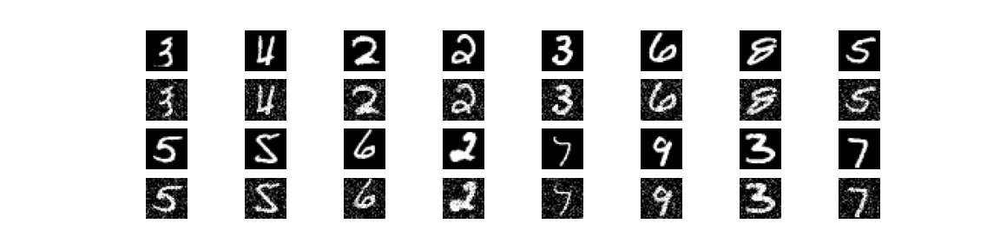
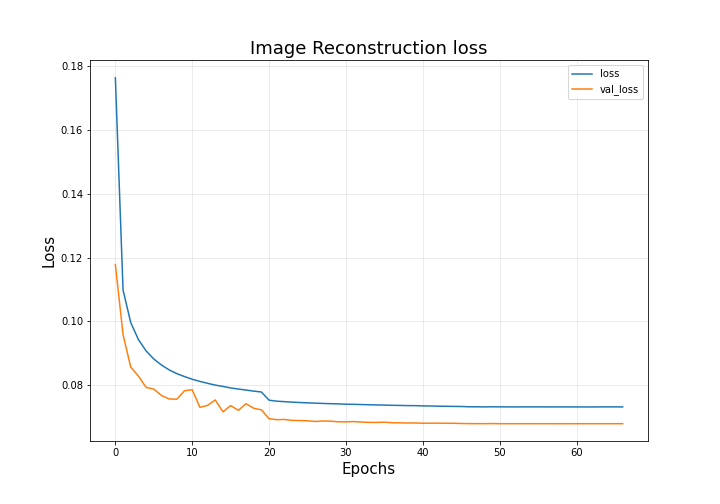
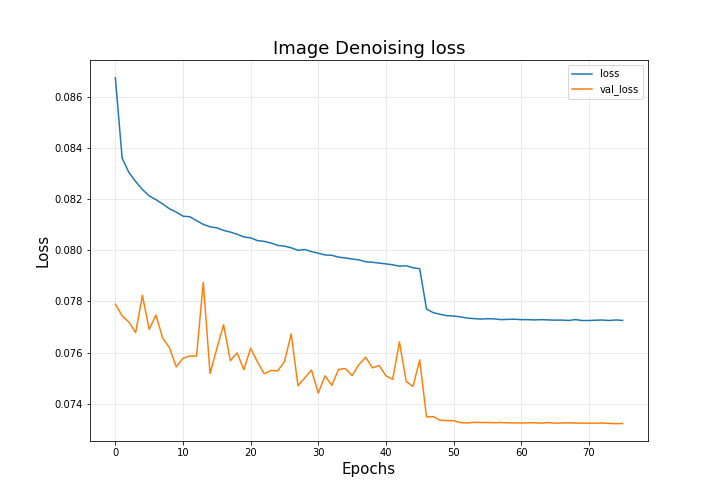
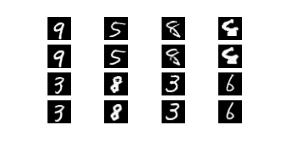

# Denoising Grayscale images

`Dataset`: MNIST

`Model Architecture`: Convolutional Autoencoder 

`Loss`: Binary Cross Entropy

`Model Input shape`: (28,28,1)

`Optimizer`: RMSProp

## Technology Used

 - Tensoflow
 - Numpy
 - Matplot.lib
 - Python

# STEPS 

 1. Download MNIST dataset and preprocess them.
 
 2. Add random  Gaussian Noise to image.
 

 3. Train a Convolutional Autoencoder
 
 4. Plot Image reconstruction loss
 

 5. Train for Image Denoising and plot the loss.
 
 
 
 6. Sample the prediction on test set.
 
 

## Usage

 python3 MNIST_AutoEncoder.ipynb

## Features

-  Callbacks used: [`ReduceLROnPlateau`, `EarlyStopping`]
-  Prevented overfitting by using Regularization [`Dropout`]

