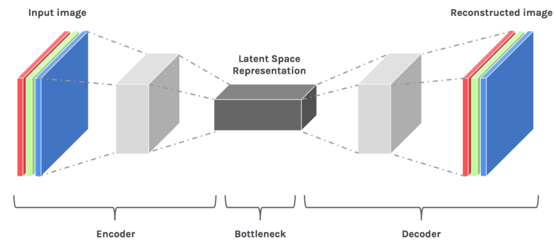

# Autoencoders

In this project I explore an unsupervised deep learning model, belonging to the neural network family, called as Autoencoder. The aim of an autoencoder is to learn a representation (encoding) for a set of data, typically for the purpose of dimensionality reduction.

# Introduction

Autoencoders are closely related to PCA (principal components analysis), but are much more flexible. Recall that with neural networks we have an activation function – this can be a “ReLU” (aka. rectifier), “tanh” (hyperbolic tangent), or sigmoid.

This introduces nonlinearities in our encoding, whereas PCA can only represent `linear transformations`.

The network representation also means you can stack autoencoders to form a deep network, also called as `Stacked Autoencoders`.

Some facts about the autoencoder:

   1. It is an unsupervised learning algorithm (like PCA)

   2. It minimizes the same objective function as PCA

   3. It is a neural network

   4. The neural network’s target output is its input

## Theory

The simplest form of an autoencoder is a feedforward, non-recurrent neural network very similar to the multilayer perceptron (MLP) – having an input layer, an output layer and one or more hidden layers connecting them, but with the output layer having the same number of nodes as the input layer, and with the purpose of reconstructing its own inputs (instead of predicting the target image given an input image). Therefore, autoencoders are unsupervised learning models.

An autoencoder always consists of two parts, the encoder network and the decoder network. The task of the encoder is to generate a lower dimensional embedding Z, which is referred to latent space, latent variables, or latent representation. After that, the decoder stage of the autoencoder maps Z  to the reconstructed image of the same shape as input image. 

The training objective is to reduce the error between input image and reconstructed image.

Different variants of Autoencoders:

  1. [Denoising Autoencoder](/Denoising) - takes a partially corrupted input whilst training to recover the original undistorted input
  
  2. Sparse autoencoder - learns sparse representations of inputs which can be used for classification tasks)
  
  3. [Variational autoencoder](/VAE)
  
  4. Contractive autoencoder (CAE) - adds an explicit regularizer in their objective function that forces the model to learn a function that is robust to slight variations of input values

Autoencoders are lossy, which means that the decompressed outputs will be degraded compared to the original inputs (similar to MP3 or JPEG compression). This differs from lossless arithmetic compression.

## Why use Autoencoders?

Similar to PCA – autoencoders can be used for finding a low-dimensional representation of your input data. Why is this useful?

Some of your features may be redundant or correlated, resulting in wasted processing time and overfitting in your model (too many parameters). It is thus ideal to only include the features we need.

If the “reconstructed image” of input image is very accurate, that implies our low-dimensional representation is good. This transformed low-dimensional data can be used as input into another model.
